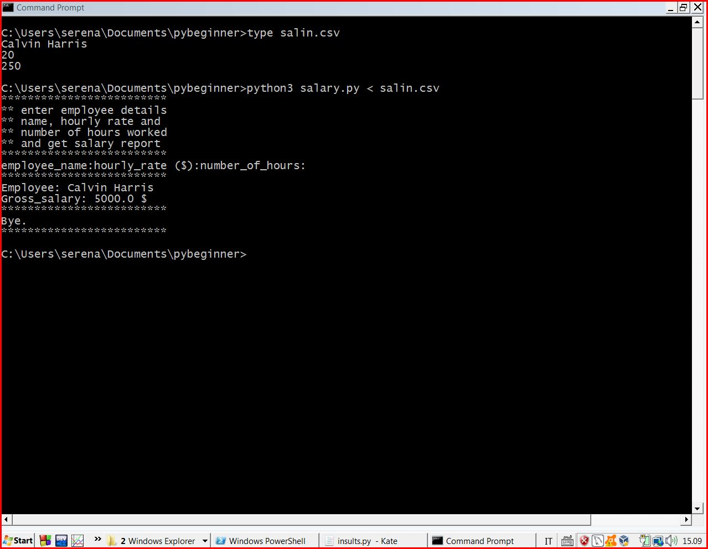

# ##################################
# python3 examples for beginners  ##
# ##################################

## Pay Attention!! you may get errors if executed using python2 interpreter

# pybeginner
# ##################################
Contains few programming examples that can be run 
using python3 interpreter, to exercise and modify at your choice.
# ##################################

- exp.py --> execute exponentiation of 2 numbers in input
              as program arguments from the command line
- inpar.py ---> shows program input parameters

- myplot.py ---> matplotlib example: shows squares points

- salary.py ---> shows gross salary report for 1 employee

- stud.py ---> shows student grades average

- sum2.py ---> sum 2 numbers

- README --> this file, contains explanations about the programs
## How to run the examples
You can use your favourite IDE (Integrated Development Environment) like
python IDLE, PyCharm, Visual Studio Code, Kdevelop, geany, ...
or a console character terminal, plus a text editor if you want to
read the code and modify it (short scripts can be also read from terminal
doing the dump of the file with command "cat" on UNIX-like OS 
or command "type" on MS win).
### Using python IDLE
All the examples can be run using a Graphical User Interface
based tool or Integrated Development Environment, the most
suitable way to start is using the python IDLE Integrated Development and Learning Environment
that is shipped with most of the python installation packages.
You just have to open the example you want to run in the python IDLE
and select from the drop-down menu Run ---> Run Module F5
When the input are given on the command line, will be easier to run
the program on a shell terminal.

you may read https://docs.python.org/3/library/idle.html for more info.
### Using a shell terminal 
You may use a shell terminal to run these examples. Since they are very
basic console scripts this may be the quicker option. 
You need to open the terminal and staying with the prompt in the
folder where the program to run is (or you should give a long
directory path, that has different syntax among different operating systems).
If you are using any Microsoft Windows version you may use the cmd terminal 
(also called command prompt)
https://www.howtogeek.com/235101/10-ways-to-open-the-command-prompt-in-windows-10/
or the newer powershell terminal. 
If you are running a GNU/Linux version
(like Ubuntu, Mint, Debian, Manjaro, Arch, OpenSUSE, Fedora, ...) or Apple MacOS
or any other UNIX-like OS you may use a bash terminal.
The directory (=folder) where the executable file is located must be included in the list
of paths in the PATH environment variable (this should be true after the installation
but you may add it manually).
We are supposing your python (version 3) and the interpreter in MacOS or Linux 
can be called python3 or just python, while in MS win the interpreter executable file 
should be called python.exe or python3.exe for the console based interpreter and pythonw.exe 
for the GUI or no UI scripts, 
see https://stackoverflow.com/questions/9705982/pythonw-exe-or-python-exe for more info.
If you want to modify the script examples and run with therminal, you need a text editor,
a very good solution is to use the kate editor https://kate-editor.org/get-it
or your favourite text editor if you have it yet. 
Using the MS win notepad is not recommended.

## terminal usage examples:
Here are shown how is possible to run the examples on the shell terminals.
It is a matter of just typing the name of the interpreter and giving
in input to it the program file name, plus input parameters if they are needed.
If the file is made executable the name of the interpreter can be omitted.
The names in square brackets like \<somename\> are placeholders to be customized 
in the specific commands.
### example running on bash terminal. 
    python3 <program.py>
### or
    python <program.py>
#
    python3 <program.py>
#
    ./python3 <program.py>
### on MS win it may be just
    python <program.py>
### or
    python3 <program.py>
#
    .\python <program.py>
### or 
    .\python3 <program.py>
### where <program.py> it is a placeholder for the actual
### python source code file
### the program inpar.py takes a list of arguments on the command line and then shows it
    ./inpar.py arg otherarg this 3 33
    Number of arguments: 6 arguments.
    Argument List: ['./inpar.py', 'arg', 'otherarg', 'this', '3', '33']
### the same without making the source executable
    python inpar.py arg otherarg this 3 33
    Number of arguments: 6 arguments.
    Argument List: ['./inpar.py', 'arg', 'otherarg', 'this', '3', '33']
#
### running on MS win the exp.py example with 10 and 3 as arguments it may be
	python exp.py 10 3
	('Number of arguments:', 3, 'arguments.')
	('Argument List:', "['exp.py', '10', '3']")
	('n^m: ', '10^3 = ', 1000)
# 
### this is another example run of myplot.py on Linux
    ./myplot.py

### the salary.py program in the following lines is shown how run on Linux terminal
you see you have to add ./ since the current folder is not included 
in the executable paths list. in MS win you should use .\ 
or may avoid it, here the parameters are given interactively

    py>./salary.py
    *************************
    ** enter employee details
    ** name, hourly rate and
    ** number of hours worked
    ** and get salary report
    *************************
    employee_name:John Smith
    hourly_rate ($):12
    number_of_hours:300

    *************************
    Employee: John Smith
    Gross_salary: 3600.0 $
    *************************
    Bye.
    *************************
#

#
### Here the parameters are read from file salin.csv
and we are using the unix-like syntax, in the picture is shown on MS win, instead.

    py>./salary.py < salin.csv 
    *************************
    ** enter employee details
    ** name, hourly rate and
    ** number of hours worked
    ** and get salary report
    *************************
    employee_name:hourly_rate ($):number_of_hours:
    *************************
    Employee: Calvin Harris
    Gross_salary: 5000.0 $
    *************************
    Bye.
    *************************
#

